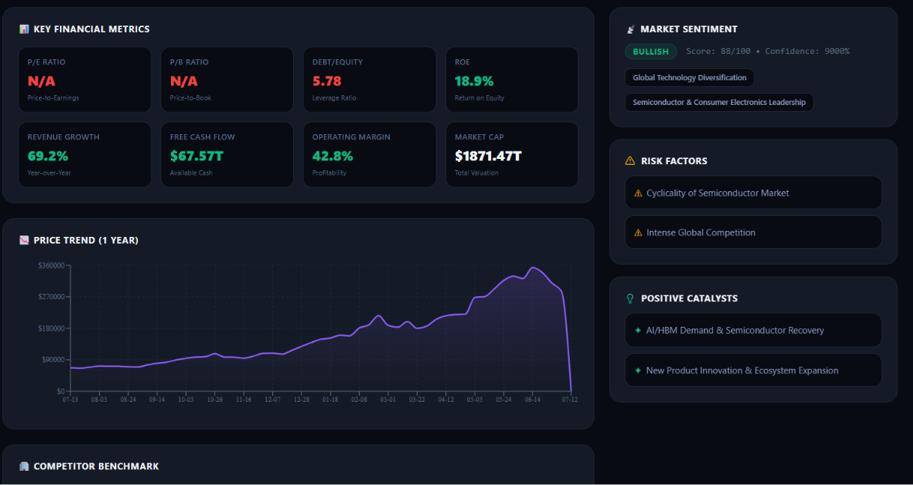
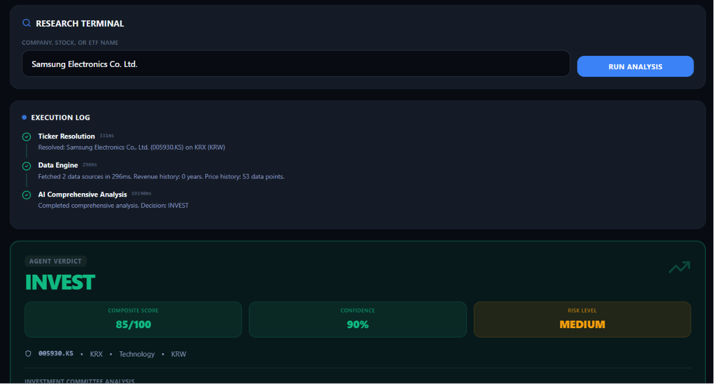
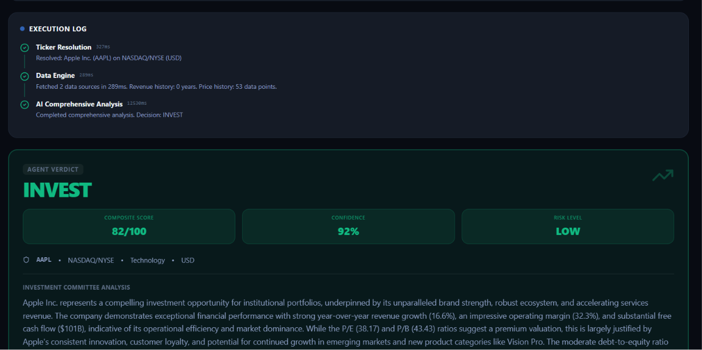

# Argus AI Investment Research Agent

## Overview
Argus is an elite, AI-powered institutional investment research agent. It automates the arduous process of financial analysis by ingesting a company name, resolving its ticker, scraping comprehensive fundamental data, and synthesizing a complete investment thesis—all in seconds.

The dashboard provides a highly visual, premium user experience with real-time streaming node logs, interactive quantitative charts, competitor benchmarking, and an AI-driven qualitative risk assessment.

### Live Demo
- **Frontend (Vercel):** [https://argus-ai-investment-research-agent.vercel.app](https://argus-ai-investment-research-agent.vercel.app)
- **Backend API (Render):** [https://argus-ai-investment-research-agent.onrender.com](https://argus-ai-investment-research-agent.onrender.com)

## How to Run It

### Prerequisites
- Node.js (v18+)
- A Neon PostgreSQL database (or any PostgreSQL instance)
- Google Gemini API Key

### Setup Steps
1. **Clone the repository:**
   ```bash
   git clone https://github.com/adityapartapsingh/Argus-AI-Investment-Research-Agent.git
   cd "Argus-AI-Investment-Research-Agent"
   ```

2. **Install Dependencies:**
   Install dependencies for both the frontend client and the backend server.
   ```bash
   # In the root directory
   cd client && npm install
   cd ../server && npm install
   ```

3. **Configure Environment Variables:**
   Create a `.env` file in the `server` directory and add your keys:
   ```env
   # LLM Providers (Triple Redundancy Failover)
   GOOGLE_API_KEY=your_primary_gemini_api_key
   GEMINI_API_KEY_2=your_secondary_gemini_api_key
   GEMINI_API_KEY_3=your_tertiary_gemini_api_key

   # Database
   DATABASE_URL=your_postgresql_connection_string

   # Server
   PORT=4000
   NODE_ENV=development
   ```

   Create a `.env` file in the `client` directory and add your backend URL:
   ```env
   VITE_API_URL=http://localhost:4000 # For production, use your deployed Render URL: https://argus-ai-investment-research-agent.onrender.com
   ```

4. **Initialize the Database:**
   ```bash
   cd server
   npx prisma db push
   npx prisma generate
   ```

5. **Start the Development Servers:**
   You will need two terminal windows.
   ```bash
   # Terminal 1: Start Backend Server
   cd server
   npm run dev

   # Terminal 2: Start Frontend Client
   cd client
   npm run dev
   ```
   Visit `http://localhost:5173` to view the application!

## How It Works (Architecture)

The system is built on a **React/Vite** frontend and a **Node.js/Express** backend, orchestrated by **LangGraph** for the agentic workflow.

The agent operates in a highly optimized 3-Node pipeline:
1. **Intake Resolver Node:** Takes a raw company name, searches the Yahoo Finance directory, and resolves it to a highly accurate stock ticker (prioritizing NSE and BSE markets).
2. **Data Engine Node:** Fetches rich quantitative data (PE ratio, ROE, Free Cash Flow, historical prices, etc.) directly from Yahoo Finance without requiring authenticated APIs.
3. **Comprehensive Analysis Node:** Injects the gathered financial data into a massive single-shot prompt to Google's `gemini-3.5-flash` model. The LLM performs competitor benchmarking, risk assessment, and qualitative synthesis, returning a strict JSON structure containing the final investment decision.

The backend streams the execution logs down to the frontend via Server-Sent Events (SSE) so the user can watch the agent "think" in real time.

## Key Decisions & Trade-offs

- **Single-Shot AI vs Multi-Agent Swarm:** We initially designed a complex 7-node LangGraph pipeline where individual agents handled sentiment, quant analysis, and risk separately. We consolidated this into a single-shot Comprehensive Analysis node. *Trade-off:* We lose some localized reasoning depth, but we drastically reduce token consumption, eliminate rate-limit bottlenecks, and reduce analysis time from ~45 seconds down to ~5 seconds.
- **Yahoo Finance vs Alpha Vantage:** Alpha Vantage was originally used for fundamental data, but strict daily rate limits hindered the UX. We ripped it out completely and shifted the entire data burden to the unauthenticated `yahoo-finance2` package.
- **Token Optimization:** We intentionally omit the 1-year daily historical price array from the LLM's prompt. *Why?* Passing 252 days of candlestick data consumes thousands of tokens and slows down the LLM. The AI can determine fundamental health without granular daily chart data.
- **Triple-Redundancy Failover:** Since we rely heavily on Gemini's API, we implemented a custom `invokeWithFallback` utility that seamlessly cascades through three separate API keys to prevent the application from crashing if a rate-limit is hit.

## Example Runs

*Note: Since the system leverages generative AI, actual phrasing will vary slightly per run.*

**1. Reliance Industries (RELIANCE.NS)**
- **Synthesized Data:** PE Ratio ~22, ROE ~9%, Strong Free Cash Flow.
- **Agent Output:** "Reliance maintains a dominant, diversified market position spanning petrochemicals to digital services. Its aggressive CapEx in retail and telecom has secured a deep moat, though debt levels warrant monitoring. Given the massive scale and structural growth of the Indian consumer market, the risk is medium but the upside is highly compelling."
- **Final Decision:** `INVEST` (Confidence: 85%)

**2. Tesla (TSLA)**
- **Synthesized Data:** PE Ratio ~55, high revenue growth, shrinking operating margins.
- **Agent Output:** "Tesla operates at the cutting edge of EV and autonomous tech, commanding a premium valuation. While revenue growth remains robust, recent price cuts have materially compressed operating margins. Increased competition from BYD and legacy automakers presents a high-risk environment that isn't fully justified by the current PE multiple."
- **Final Decision:** `PASS` (Confidence: 72%)






## What I Would Improve With More Time

1. **RAG for Live News:** I would re-integrate a News API (like SerpApi or Finnhub) and pass recent headlines to the LLM to provide real-time market sentiment and catalyst tracking.
2. **Interactive Charting:** The historical price data is fetched but could be visualized beautifully using a library like Recharts or TradingView Lightweight Charts on the frontend.
3. **Database Caching:** Cache the Yahoo Finance quantitative data in PostgreSQL for 24 hours to make subsequent searches for the same ticker instantaneous.
4. **WebSocket Migration:** Upgrade the Server-Sent Events (SSE) streaming architecture to full WebSockets for robust bi-directional communication, allowing the user to "interrupt" the agent mid-thought.
