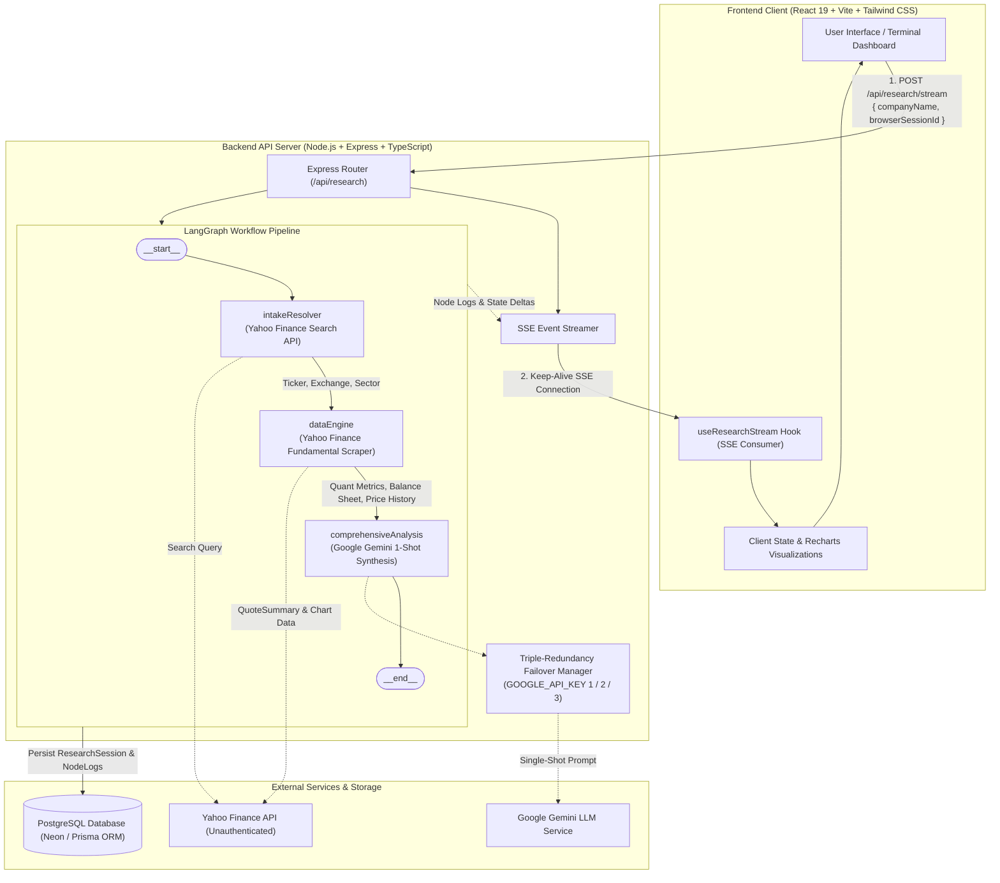

# System Architecture & Technical Specifications — Argus AI

---

## 1. System Architecture

Argus adopts a decoupled client-server architecture powered by a high-throughput **LangGraph** execution engine and real-time **Server-Sent Events (SSE)**.



---

## 2. High-Level Tech Stack

### Frontend Application
| Layer | Technology | Purpose |
| :--- | :--- | :--- |
| **Framework** | **React 19 (v19.2.7)** | Reactive view rendering and concurrent UI updates. |
| **Build Tool** | **Vite (v8.1.1)** | Rapid HMR and optimized asset bundling. |
| **Language** | **TypeScript (~6.0)** | End-to-end type safety. |
| **Styling** | **Tailwind CSS (v4.3.2)** | Utility-first styling with custom dark-terminal `@theme` variables. |
| **Animations** | **Framer Motion (v12.42)** | Smooth state transitions, accordion expansion, and telemetry stream effects. |
| **Data Viz** | **Recharts (v3.9.2)** | Interactive financial charts (Revenue & Net Income multi-year bars). |
| **Icons** | **Lucide React (v1.24)** | Clean institutional iconography. |
| **Routing** | **React Router DOM (v7.18)** | Application routing between Landing and Research Terminal. |

### Backend API & Agent Core
| Layer | Technology | Purpose |
| :--- | :--- | :--- |
| **Runtime** | **Node.js (v18+)** | Asynchronous event-driven execution environment. |
| **Web Server** | **Express (v5.x)** | REST endpoints and HTTP streaming via SSE (`text/event-stream`). |
| **Orchestrator** | **LangGraph (@langchain/langgraph)** | Directed StateGraph pipeline managing workflow, nodes, and reducers. |
| **LLM Provider** | **@google/genai & LangChain Google GenAI** | Gemini models with custom multi-key fallback. |
| **Financial Scraper**| **yahoo-finance2** | High-reliability, unauthenticated equity fundamentals & price history. |
| **Database ORM** | **Prisma ORM (v7.x)** | Declarative schema modeling, migrations, and PostgreSQL client. |
| **Database** | **PostgreSQL (Neon DB)** | Relational storage for sessions, logs, and financial snapshots. |

---

## 3. Folder Structure

```
Argus-AI-Investment-Research-Agent/
├── .gitignore                     # Git ignore rules (node_modules, env, memory.md, task.md)
├── package.json                   # Root workspace scripts
├── render.yaml                    # Render deployment blueprint
├── README.md                      # Project documentation and quickstart
├── docs/                          # Comprehensive Documentation
│   ├── prd.md                     # Product Requirements Document
│   ├── architecture.md            # System Architecture & Tech Stack (This File)
│   ├── design.md                  # Design System, Theme, Components & Style Guide
│   ├── memory.md                  # Institutional Memory, Decisions & State
│   └── task.md                    # Project Roadmap, Milestones & Backlog
│
├── client/                        # Frontend Application (React 19 + Vite)
│   ├── index.html                 # Main HTML entry
│   ├── package.json               # Client dependencies and scripts
│   ├── vite.config.ts             # Vite configuration with Tailwind CSS plugin
│   ├── tsconfig.json              # TypeScript root config
│   ├── public/                    # Static assets (favicons, SVGs)
│   └── src/
│       ├── main.tsx               # Client bootstrap
│       ├── App.tsx                # App routing and view hierarchy
│       ├── index.css              # Dark terminal & light landing design tokens
│       ├── assets/                # Images, hero mockups, SVGs
│       ├── types/
│       │   └── research.ts        # Shared TypeScript interfaces for research states
│       ├── hooks/
│       │   ├── useResearchStream.ts # SSE consumer hook for live agent streaming
│       │   └── useSearchHistory.ts  # Session persistence and history retrieval
│       ├── utils/
│       │   └── session.ts         # Anonymous browser session ID generator
│       └── components/
│           ├── landing/           # Landing page sections
│           │   ├── LandingPage.tsx
│           │   ├── HeroSection.tsx
│           │   ├── FeaturesSection.tsx
│           │   ├── InteractiveCharts.tsx
│           │   ├── PricingSection.tsx
│           │   └── DemoModal.tsx
│           ├── layout/            # Shell layout components
│           │   ├── Header.tsx     # Navigation, ticker marquee, theme toggle
│           │   └── Sidebar.tsx    # Research history drawer
│           └── research/          # Core research terminal components
│               ├── InputPanel.tsx         # Search bar and market selector
│               ├── NodeStream.tsx         # Live SSE log console & telemetry
│               ├── AnalyzingAnimation.tsx # Terminal pulse loader
│               ├── Scorecard.tsx          # INVEST/PASS verdict & composite rating
│               ├── QuantMetrics.tsx       # Valuation & solvency financial cards
│               ├── RevenueChart.tsx       # Multi-year revenue & income bars
│               ├── CompetitorTable.tsx    # Peer comparison matrix
│               └── RiskSummary.tsx        # Risk breakdown and thesis memo
│
└── server/                        # Backend Application (Node.js + Express + LangGraph)
    ├── package.json               # Server dependencies and scripts
    ├── tsconfig.json              # Backend TypeScript config
    ├── prisma/
    │   └── schema.prisma          # PostgreSQL schema (ResearchSession, NodeLog)
    └── src/
        ├── index.ts               # Server entrypoint and Express configuration
        ├── db.ts                  # Prisma Client singleton
        ├── middleware/
        │   └── errorHandler.ts    # Global error interceptor
        ├── routes/
        │   ├── research.ts        # POST /api/research/stream (SSE streaming)
        │   └── history.ts         # GET /api/research/history
        ├── services/
        │   └── keepAlive.ts       # 24/7 self-ping watchdog preventing Render sleep
        ├── llm/
        │   └── provider.ts        # Triple-redundant Gemini client with failover
        └── agent/
            ├── state.ts           # Central Annotation state definition & reducers
            ├── engine.ts          # StateGraph construction and compilation
            ├── tools/
            │   └── yahooFinance.ts# Scraper utilities for quotes, profiles, financials
            └── nodes/
                ├── intakeResolver.ts       # Node 1: Ticker & exchange search
                ├── dataEngine.ts           # Node 2: Fundamental metrics scraper
                └── comprehensiveAnalysis.ts# Node 3: Single-shot Gemini synthesis
```

---

## 4. User Flow

```mermaid
sequenceDiagram
    autonumber
    actor User as Investor / Analyst
    participant UI as React Frontend
    participant Server as Express Server
    participant Engine as LangGraph Agent
    participant Gemini as Google Gemini LLM
    participant DB as PostgreSQL

    User->>UI: Types company name (e.g. "Tata Motors") & clicks "Analyze"
    UI->>Server: POST /api/research/stream { companyName, browserSessionId }
    Server-->>UI: 200 OK (Content-Type: text/event-stream)
    
    rect rgb(20, 27, 38)
        Note over Engine: Node 1: intakeResolver
        Engine->>Engine: Searches Yahoo Finance directory
        Engine-->>Server: Log: Resolved to TATAMOTORS.NS (NSE)
        Server-->>UI: SSE event: node_log { node: "intakeResolver", status: "completed" }
    end

    rect rgb(20, 27, 38)
        Note over Engine: Node 2: dataEngine
        Engine->>Engine: Scrapes P/E, ROE, FCF, Debt, Balance Sheet, Peers
        Engine-->>Server: Log: Sourced 24 financial datapoints
        Server-->>UI: SSE event: node_log { node: "dataEngine", status: "completed" }
    end

    rect rgb(20, 27, 38)
        Note over Engine: Node 3: comprehensiveAnalysis
        Engine->>Gemini: Single-shot structured prompt with quantitative payload
        Gemini-->>Engine: Strict JSON (Decision: INVEST, Score: 84, Risks, Thesis)
        Engine-->>Server: Log: Synthesis complete
        Server-->>UI: SSE event: node_log { node: "comprehensiveAnalysis", status: "completed" }
    end

    Engine->>DB: Saves ResearchSession and NodeLogs
    Server-->>UI: SSE event: final_result { full state payload }
    Server-->>UI: Closes SSE stream
    UI->>User: Displays interactive Scorecard, Metrics Grid, Recharts & Risk Memo
```



---

## 5. Information Architecture

```
Argus Information Architecture
│
├── 1. Landing View (Public Showcase)
│   ├── Navigation Bar (Brand, Features, Architecture, Live Demo CTA)
│   ├── Hero Section (Value proposition, demo trigger, animated preview)
│   ├── Interactive Feature Grid (Sub-10s analysis, Zero-Auth, SSE Streaming)
│   ├── Interactive Mock Terminal (Live chart sample, decision preview)
│   └── Pricing & Tier Matrix (Boutique, Institutional, Prosumer)
│
└── 2. Research Terminal (Application Core)
    ├── App Header
    │   ├── Brand & Version Telemetry
    │   ├── Real-Time Indian/Global Market Status Indicator
    │   └── Research History Toggle
    │
    ├── Sidebar (History Drawer)
    │   ├── Recent Search History List
    │   ├── Past Session Timestamp, Ticker & Decision Tag
    │   └── Session Reload & Clear History Actions
    │
    ├── Control Panel
    │   ├── Search Query Input (Company Name or Ticker)
    │   ├── Market Focus Selector (NSE/BSE India vs. Global/US)
    │   └── Execution Trigger ("Initialize Research")
    │
    ├── Execution Telemetry Console (Active during analysis)
    │   ├── Step-by-Step Node Progress Bar (Intake ➔ Data Engine ➔ AI Synthesis)
    │   ├── Live Terminal Logs (Timestamps, Node names, millisecond counters)
    │   └── Error Diagnostics & Fallback Notifications
    │
    └── Research Dossier Dashboard (Rendered upon completion)
        ├── 1. Verdict & Scorecard Panel
        │   ├── Final Decision (`INVEST` vs. `PASS`)
        │   ├── Composite Alpha Score (0–100 Gauge)
        │   ├── Risk Level Indicator (`LOW`, `MEDIUM`, `HIGH`, `CRITICAL`)
        │   └── Confidence Percentage Rating
        │
        ├── 2. Fundamental & Quantitative Grid
        │   ├── Valuation Metrics (P/E, P/B, Market Cap)
        │   ├── Solvency & Leverage (Debt-to-Equity, Total Debt, Total Cash)
        │   └── Efficiency & Cash Flow (ROE, Operating Margin, Free Cash Flow)
        │
        ├── 3. Historical Financials Visualization
        │   ├── Multi-Year Revenue vs. Net Income Comparison (Recharts)
        │   └── Year-over-Year Trajectory & Margin Consistency
        │
        ├── 4. Competitor Benchmarking Matrix
        │   ├── Peer Comparison Table (Peer Ticker, Market Cap, P/E, Margin)
        │   └── Relative Valuation & Positioning Context
        │
        └── 5. Qualitative Synthesis & Risk Assessment
            ├── Executive Investment Summary (Structured Thesis Memo)
            ├── Key Competitive Moats & Catalysts
            └── Vulnerabilities & Downside Risk Factors
```
